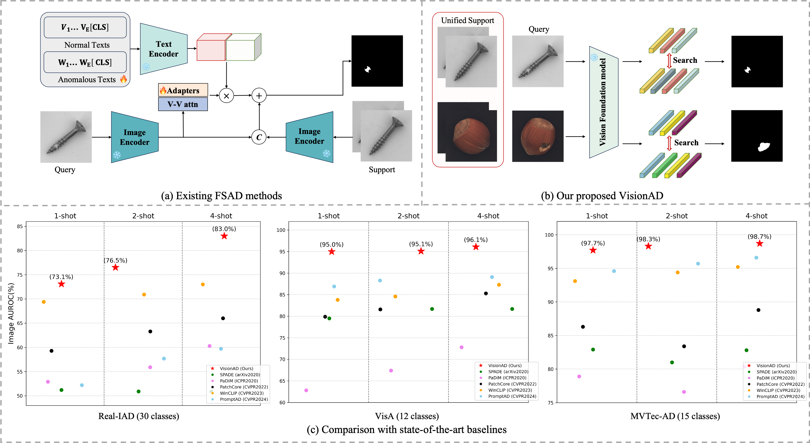

<div align="center">

# Search is All You Need for Few-shot Anomaly Detection

[arxiv](https://arxiv.org/abs/2504.11895)

</div>

PyTorch Implementation of "Search is All You Need for Few-shot Anomaly Detection".

Give me a ⭐️ if you like it.




## News
 - 16.04.2025: Arxiv preprint and github code released🚀

 - 17.04.2025:Translated and reposted by Zhihu influencer "[I Love Computers](https://zhuanlan.zhihu.com/p/1896247110023767999)".

 - 19.04.2025:Included in the popular industrial anomaly detection repository [awesome-industrial-anomaly-detection](https://github.com/M-3LAB/awesome-industrial-anomaly-detection).
 
 - 20.06.2025: Withdraw the submission from ACMMM as it received a low rating of 53644.
 
 - 17.08.2025: The manuscript has been submitted to a Q1 journal.

## Abstract

Few-shot anomaly detection (FSAD) has emerged as a crucial yet challenging task in industrial inspection, where normal distribution modeling must be accomplished with only a few normal images. While existing approaches typically employ multi-modal foundation models combining language and vision modalities for prompt-guided anomaly detection, these methods often demand sophisticated prompt engineering and extensive manual tuning. In this paper, we demonstrate that a straightforward nearest-neighbor search framework can surpass state-of-the-art performance in both single-class and multi-class FSAD scenarios. Our proposed method, VisionAD, consists of four simple yet essential components: (1) scalable vision foundation models that extract universal and discriminative features; (2) dual augmentation strategies-support augmentation to enhance feature matching adaptability and query augmentation to address the oversights of single-view prediction; (3) multi-layer feature integration that captures both low-frequency global context and high-frequency local details with minimal computational overhead;and (4) a class-aware visual memory bank enabling efficient one-for-all multi-class detection. Extensive evaluations across MVTec-AD, VisA, and Real-IAD benchmarks demonstrate VisionAD's exceptional performance. Using only 1 normal images as support, our method achieves remarkable image-level AUROC scores of 97.4\%, 94.8\%, and 70.8\% respectively, outperforming current state-of-the-art approaches by significant margins (+1.6\%, +3.2\%, and +1.4\%). The training-free nature and superior few-shot capabilities of VisionAD make it particularly appealing for real-world applications where samples are scarce or expensive to obtain.

## 1. Environments

Create a new conda environment and install required packages.

```
conda create -n VisionAD python=3.8.12
conda activate VisionAD
pip install -r requirements.txt
```
Experiments are conducted on NVIDIA GeForce RTX 3090 (24GB). Same GPU and package version are recommended. 

## 2. Prepare Datasets
You can also change the dataset directory as needed; just remember to update the `data_path` in the code accordingly.

### MVTec AD

Download the MVTec-AD dataset from [URL](https://www.mvtec.com/company/research/datasets/mvtec-ad).
Unzip the file to `../mvtec_anomaly_detection`.
```
|-- mvtec_anomaly_detection
    |-- bottle
    |-- cable
    |-- capsule
    |-- ....
```


### VisA

Download the VisA dataset from [URL](https://github.com/amazon-science/spot-diff).
Unzip the file to `../VisA/`. Preprocess the dataset to `../VisA_pytorch/` in 1-class mode by their official splitting 
[code](https://github.com/amazon-science/spot-diff).

You can also run the following command for preprocess, which is the same to their official code.

```
python ./prepare_data/prepare_visa.py --split-type 1cls --data-folder ../VisA --save-folder ../VisA_pytorch --split-file ./prepare_data/split_csv/1cls.csv
```
`../VisA_pytorch` will be like:
```
|-- VisA_pytorch
    |-- 1cls
        |-- candle
            |-- ground_truth
            |-- test
                    |-- good
                    |-- bad
            |-- train
                    |-- good
        |-- capsules
        |-- ....
```
 
### Real-IAD
Contact the authors of Real-IAD [URL](https://realiad4ad.github.io/Real-IAD/) to get the net disk link.

Download and unzip `realiad_1024` and `realiad_jsons` in `../Real-IAD`.
`../Real-IAD` will be like:
```
|-- Real-IAD
    |-- realiad_1024
        |-- audiokack
        |-- bottle_cap
        |-- ....
    |-- realiad_jsons
        |-- realiad_jsons
        |-- realiad_jsons_sv
        |-- realiad_jsons_fuiad_0.0
        |-- ....
```

## 3. Run Experiments
<!--Multi-Class Setting
```
python dinomaly_mvtec_uni.py --data_path ../mvtec_anomaly_detection
```
```
python dinomaly_visa_uni.py --data_path ../VisA_pytorch/1cls
```
```
python dinomaly_realiad_uni.py --data_path ../Real-IAD
``` -->

Conventional Class-Separted Setting
```
python dade_mvtec_test.py --data_path ../mvtec_anomaly_detection
```
```
python dade_visa_test.py --data_path ../VisA_pytorch/1cls
```
<!--```
python dinomaly_realiad_sep.py --data_path ../Real-IAD
```-->

## Citation
```
@article{wang2025search,
  title={Search is All You Need for Few-shot Anomaly Detection},
  author={Wang, Qishan and Guo, Jia and Gao, Shuyong and Wang, Haofen and Xiong, Li and Hu, Junjie and Guo, Hanqi and Zhang, Wenqiang},
  journal={arXiv preprint arXiv:2504.11895},
  year={2025}
}

